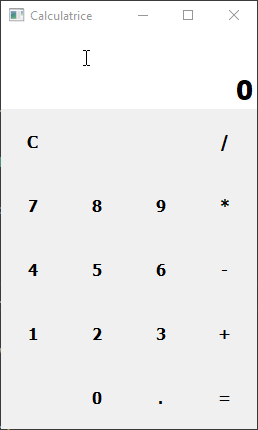

# Calculatrice

## Notions abordées

- Condition, Boucle et Liste
- Fonction ```eval()```
- Module ```PySide2``` (ou autres module pour créé des interfaces graphiques)

## Énoncé

Vous devez créer une interface graphique pour créer une calculatrice avec les 4 opérations de base : addition, soustraction, multiplication et division.

Résultat :



## Solution

Le code de la solution a été écrit sous Windows 10 avec Python v3.7.4.

J'utilise la librairie PySide2 donc si vous voulez tester ma solution, il faudra installer ce module.
J'ai aussi utilisé QtDesigner installé avec PySide2 pour pouvoir faire l'interface graphique de manière très simple donc dans le dossier [custom_ui](./custom_ui) se trouve le fichier fenetrePrincipale.ui généré par QtDesigner et le fichier fenetrePrincipale.py qui est le fichier .ui "convertis" en Python grâce à **pyside2uic**.

```pip install PySide2``` 