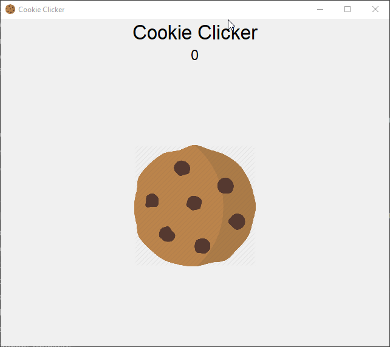

# Cookie Clicker

## Notions abordées

- Condition
- Liste
- Module ```tkinter``` (ou autres module pour créé des interfaces graphiques)
- Module ```os``` et ```json``` pour enregistrer le compteur

## Énoncé

Vous devez créer une interface graphique avec une image de cookie au centre de l'écran et à chaque fois que l'utilisateur clique sur le cookie incrémente le compteur de cookie. Une fois que la fenêtre a été fermé, enregistre le compteur dans un fichier .json comme ça à la prochaine exécution du programme le compteur sera initialisé à la valeur de la dernière utilisation.

Résultat :



## Solution

Le code de la solution a été écrit sous Windows 10 avec Python v3.7.4.

Afin de redimensionner l'image et de l'afficher correctement, j'ai utilisé le module Pillow donc veuillez l'installer avant d'exécuter ma solution.

```pip install Pillow``` 
