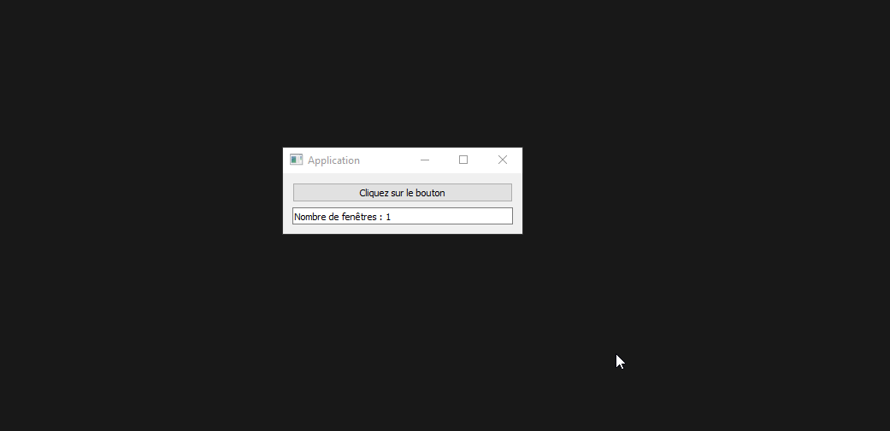

# Fenêtres Infinies

## Notions abordées

- Condition, Boucle et Liste
- Module ```PySide2``` (ou autres module pour créé des interfaces graphiques)

## Énoncé

Vous devez créer une interface graphique avec un bouton, à chaque fois que l'utilisateur cliquera sur le bouton, une nouvelle fenêtre (la même) sera créé, puis en dessous du bouton figurera le nombre de fenêtres ouvertes en temps réel actualiser sur toutes les fenêtres ouvertes, ainsi si l'utilisateur ferme une fenêtre, actualise le nombre de fenêtres ouvertes.

Résultat :



## Solution

Le code de la solution a été écrit sous Windows 10 avec Python v3.7.4.

J'utilise la librairie PySide2 donc si vous voulez tester ma solution, il faudra installer ce module.

```pip install PySide2``` 
