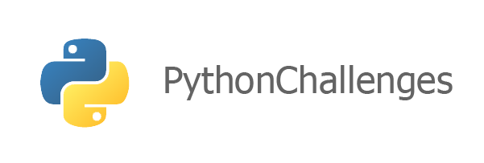

<h1 align="center">PythonChallenges</h1>

  <strong>Exercices et challenges en français pour s'améliorer en Python.</strong>

  
  
  
  
  
     
  

## 🐍 À propos
**PythonChallenges** regroupe plein d'exercices et challenges en français pour s'améliorer en Python.

Chaque **challenge** dispose de ça **solution** et de son **énoncé** afin que vous puissiez essayer de les résoudre tout seul, parfait pour s'entraîner et pratiquer votre algorithmie en **Python**. 

## 📖 Sommaire des challenges

- [Calcul de moyenne](./Calcul_de_moyenne)
- [Encodage des caractères et conversion en Binaire, en Hexadécimal, etc.](./Encodage_caractere)
- [La liste de course](./La_liste_de_course)
- [Mastermind](./Mastermind)
- [Nombre Mystère](./Nombre_mystere)
- [Nombre Premier](./Nombre_premier)
- [Palindrome](./Palindrome)
- [Trigonométrie - Mesure Principale](./Trigonometrie_Mesure_Principale)

## 🧠 Bloquer sur un exercice ?

Surtout n'abandonner pas, et ne regarder pas la solution, faîtes la vôtre !
Afin de vous aider à résoudre ces différents exercices, j'ai mis en place un fichier [HELP.md](./HELP.md) avec la méthodologie que j'utilise quand je suis face à un problème donnée. C'est une méthodologie parmi tant d'autre et malheureusement ça ne fait pas des miracles alors au boulot ! 😉

## 🚀 Comment contribuer ? 

Vous aimez **PythonChallenges** et vous voulez proposer vos challenges, proposer une solution ou même corriger une simple faute d'orthographe ? 
Tout le monde peut contribuer à l'amélioration du projet !
Les étapes à suivre pour contribuer se trouvent dans le fichier [CONTRIBUTING.md](./CONTRIBUTING.md).

## 📄 Licence

Ce projet est sous licence MIT - voir le fichier [LICENSE](./LICENSE) pour plus de détails.
